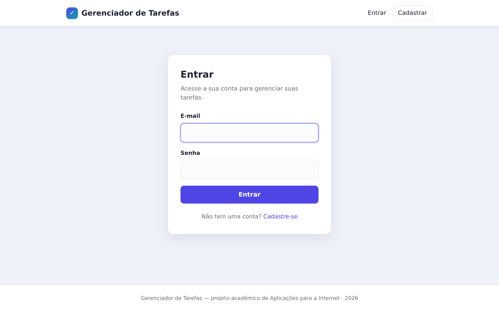
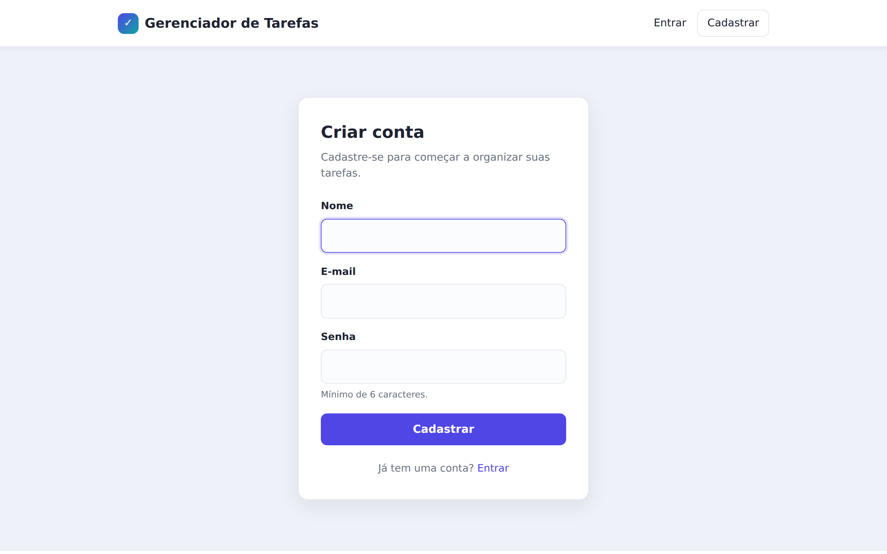
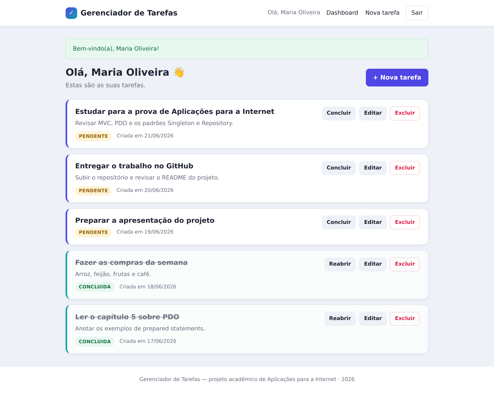
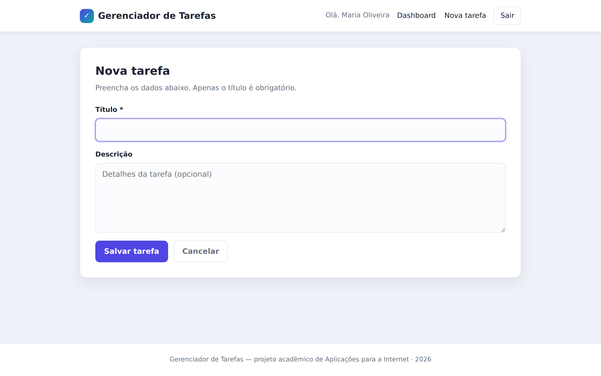
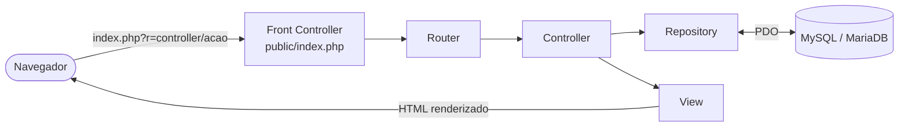

<div align="center">

# ✅ Gerenciador de Tarefas (To-Do)

**Aplicação web em PHP puro com arquitetura MVC e _design patterns_, para o gerenciamento de tarefas pessoais.**
Cada usuário autenticado gerencia somente as suas próprias tarefas, com login seguro e CRUD completo.


</div>

---

## 📌 Sobre o projeto

Projeto desenvolvido para a disciplina de **Aplicações para a Internet**. O objetivo é demonstrar,
na prática, a organização de uma aplicação web seguindo o padrão **MVC** (Model-View-Controller) e a
aplicação explícita de três **design patterns** consagrados — **Singleton**, **Repository** e
**Front Controller** — usando apenas PHP puro, sem nenhum framework.

A aplicação é um gerenciador de tarefas (_to-do list_): o usuário se cadastra, faz login e mantém uma
lista pessoal de tarefas, podendo criá-las, editá-las, marcá-las como concluídas e excluí-las.

---

## ✨ Funcionalidades

- 👤 **Cadastro de usuário** com e-mail único e senha protegida por _hash_ bcrypt.
- 🔑 **Login e logout** com mensagens amigáveis (_flash messages_).
- 🏠 **Dashboard** com saudação personalizada e a lista de tarefas do usuário logado.
- 📝 **CRUD completo de tarefas**: criar, listar, editar e excluir.
- 🔄 **Alternância de status** entre _pendente_ e _concluída_.
- ⚠️ **Confirmação** antes de excluir uma tarefa.
- 🔒 **Isolamento por usuário**: ninguém acessa, edita ou exclui tarefas de outra pessoa.

---

## 🖼️ Demonstração

### Autenticação

<table>
  <tr>
    <td width="50%" align="center"><b>Tela de Login</b></td>
    <td width="50%" align="center"><b>Tela de Cadastro</b></td>
  </tr>
  <tr>
    <td></td>
    <td></td>
  </tr>
</table>

### Dashboard — lista de tarefas

<p align="center">
  
</p>

### Adição de tarefa

<p align="center">
  
</p>

---

## 🛠️ Tecnologias

| Camada            | Tecnologia                                              |
|-------------------|---------------------------------------------------------|
| Linguagem         | **PHP 8+** (sem frameworks)                              |
| Banco de dados    | **MySQL / MariaDB** via **PDO** com _prepared statements_ |
| Front-end         | **HTML5** e **CSS3** (folha de estilo própria, responsiva) |
| Autenticação      | **Sessões nativas** do PHP + _hash_ bcrypt              |
| Servidor (alvo)   | **XAMPP** (Apache + MariaDB/MySQL + PHP)                |

---

## 🏗️ Arquitetura MVC

O código é organizado seguindo o padrão **Model-View-Controller**, separando claramente as
responsabilidades. O acesso ao banco fica isolado em uma camada de **repositories**, mantendo os
controllers livres de SQL.



| Camada          | Pasta                 | Responsabilidade                                              |
|-----------------|-----------------------|--------------------------------------------------------------|
| **Model**       | `app/models/`         | Entidades do domínio (`User`, `Task`) — representam os dados. |
| **View**        | `app/views/`          | Apresentação. Exibe os dados, escapando toda saída com `htmlspecialchars()`. |
| **Controller**  | `app/controllers/`    | Recebe a requisição, coordena os repositórios e escolhe a view. |
| **Repository**  | `app/repositories/`   | Isola todo o acesso ao banco (consultas SQL).                |
| **Core**        | `app/core/`           | Infraestrutura: `Database`, `Router` e `Controller` base.     |

> **Fluxo de uma requisição:** o navegador chama `public/index.php` (Front Controller), que inicializa
> a aplicação e entrega a rota ao `Router`. Este instancia o **Controller** adequado, que usa um
> **Repository** para falar com o banco via **PDO** e, por fim, renderiza uma **View** de volta ao usuário.

---

## 🎯 Padrões de projeto

Os três padrões abaixo estão comentados no código, no ponto exato em que são aplicados.

### 1. Singleton — `app/core/Database.php`
Garante uma **única instância da conexão PDO** por requisição. Possui construtor privado,
propriedade estática `$instance`, método estático `getInstance()` e bloqueio de `__clone()` / `__wakeup()`.

### 2. Repository — `app/repositories/UserRepository.php` e `TaskRepository.php`
Toda a lógica de acesso ao banco fica isolada nos repositórios. Os controllers nunca escrevem SQL:
apenas chamam métodos como `findByEmail()`, `create()`, `findByUserId()`, `update()` e `delete()`.

### 3. Front Controller — `public/index.php`
É o **único ponto de entrada** da aplicação. Carrega a configuração, registra o autoloader, inicia a
sessão, define a `BASE_URL` e delega o roteamento à classe `Router`.

---

## 🔒 Segurança

- 🛡️ **PDO + _prepared statements_** em todas as queries (proteção contra SQL Injection).
- 🔑 **Senhas com _hash_ bcrypt** (`password_hash()` / `password_verify()`) — nunca em texto puro.
- 🧼 **`htmlspecialchars()`** em toda saída de dados do usuário (proteção contra XSS).
- 🚪 **Proteção de rotas**: páginas internas exigem sessão ativa (`requireAuth()`).
- 👥 **Verificação de propriedade (_ownership_)** em duas camadas (controller + cláusula `WHERE`).
- 🎫 **Proteção contra CSRF**: token único por sessão, validado com `hash_equals()` em todo formulário.
- 📮 **Ações destrutivas só por POST**: excluir, alternar status e logout não são acionáveis por `GET`.
- 🍪 **Cookie de sessão endurecido**: `HttpOnly`, `SameSite=Lax`, `Secure` (em HTTPS) e `use_strict_mode`.
- 🔁 **`session_regenerate_id()`** após o login (proteção contra _session fixation_).
- 🧯 **Tratador global de erros**: exceções viram uma página 500 genérica, sem expor _stack traces_.

---

## 🚀 Como executar no XAMPP

> **Requisitos:** XAMPP com PHP 8+ e MariaDB/MySQL.

1. **Copie o projeto** para a pasta `htdocs` do XAMPP. Exemplo final:
   `C:\xampp\htdocs\todo-php`.

2. **Inicie o Apache e o MySQL** pelo painel de controle do XAMPP.

3. **Importe o banco de dados.** Abra o phpMyAdmin (`http://localhost/phpmyadmin`), vá em
   *Importar* e selecione o arquivo `sql/schema.sql` (cria o banco `todo_mvc` e as tabelas).
   Alternativa por linha de comando:
   ```bash
   mysql -u root < sql/schema.sql
   ```

4. **Ajuste a configuração**, se necessário, em `config/config.php` (host, banco, usuário e senha).
   Os valores padrão já funcionam em uma instalação típica do XAMPP (`root` sem senha).

5. **Acesse a aplicação** no navegador, apontando para a pasta `public/`:
   ```
   http://localhost/todo-php/public/
   ```

6. **Crie uma conta** na tela de cadastro e comece a usar. 🎉

> 💡 A `BASE_URL` é detectada automaticamente, então o projeto funciona mesmo que você o coloque em
> uma subpasta diferente dentro do `htdocs`.

---

## 📂 Estrutura de pastas

<details>
<summary>Clique para expandir a árvore de diretórios</summary>

```
todo-php/
├── app/
│   ├── controllers/
│   │   ├── AuthController.php
│   │   ├── DashboardController.php
│   │   └── TaskController.php
│   ├── core/
│   │   ├── Database.php        (Singleton)
│   │   ├── Controller.php      (controller base: render, redirect, requireAuth, CSRF)
│   │   └── Router.php          (resolve a rota e despacha o controller/ação)
│   ├── models/
│   │   ├── User.php
│   │   └── Task.php
│   ├── repositories/
│   │   ├── UserRepository.php  (Repository)
│   │   └── TaskRepository.php  (Repository)
│   └── views/
│       ├── layouts/
│       │   ├── header.php
│       │   └── footer.php
│       ├── auth/
│       │   ├── login.php
│       │   └── register.php
│       ├── dashboard/
│       │   └── index.php
│       └── tasks/
│           ├── create.php
│           └── edit.php
├── config/
│   └── config.php
├── public/
│   ├── index.php              (Front Controller: único ponto de entrada)
│   └── css/
│       └── style.css
├── docs/
│   └── screenshots/           (imagens usadas neste README)
├── sql/
│   └── schema.sql
├── .gitignore
└── README.md
```

</details>

---

## 🧭 Rotas

O roteamento é feito por _query string_ (`index.php?r=controller/acao`), dispensando o `mod_rewrite`.

| Rota                       | Método      | Ação                                  |
|----------------------------|-------------|---------------------------------------|
| `?r=auth/login`            | GET / POST  | Tela de login / autenticação          |
| `?r=auth/register`         | GET / POST  | Tela de cadastro                      |
| `?r=auth/logout`           | POST        | Logout                                |
| `?r=dashboard/index`       | GET         | Dashboard com as tarefas              |
| `?r=task/create`           | GET / POST  | Criar tarefa                          |
| `?r=task/edit&id=ID`       | GET / POST  | Editar tarefa                         |
| `?r=task/toggle&id=ID`     | POST        | Alternar status da tarefa             |
| `?r=task/delete&id=ID`     | POST        | Excluir tarefa                        |

> As ações que alteram dados (`logout`, `task/toggle`, `task/delete`, além de
> `create`/`edit`/`register`/`login` no envio) são feitas por `POST` com token CSRF.

---

<div align="center">

Projeto acadêmico — disciplina de **Aplicações para a Internet**.

</div>
